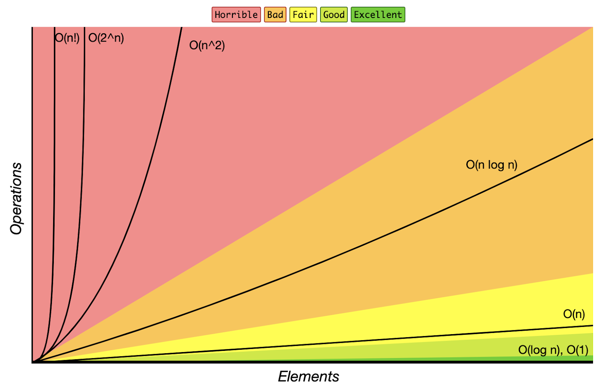

# Introduce to big O

> If you already understand big O, you can skip this article.

Big O is a notation used to describe the computational complexity of an algorithm. The computational complexity of an algorithm is split into two parts: time complexity and space complexity. 

* The time complexity of an algorithm is the amount of time the algorithm needs to run relative to the input size.
* The space complexity of an algorithm is the amount of memory allocated by the algorithm when run relative to the input size.

> Typically, people care about having a better time complexity more than having a better space complexity.

Complexity is described by a function of variables that can change with the input. The most common variable is *n*, which usually describes the length of an input array or string. This function is wrapped by a capital **O**. Here are some example complexities:

- $`O(n)`$
- $`O(n^2)`$
- $`O(2^n)`$
- $`O(log n)`$
- $`O(n \times m)`$

These functions describe how the amount of operations/memory needed by the algorithm grows as the arguments **tend to infinity**. Because the variables are tending to infinity, **constants are always ignored**. That means that $`O(999999n)`$ = $`O(7n)`$ = $`O(n)`$ = $`O(n \div 500)`$.

> The point of computational complexity is to analyze how an algorithm scales with the input. Let's say you have two algorithms. One runs in 
_O(100n)_ and the other runs in _O(5n)_. Even though the second algorithm runs 20x faster, both algorithm's operations grow linearly with _n_. If you double _n_, then both algorithms will take 2x longer regardless of what the coefficients are.

Being able to analyze an algorithm and derive its time and space complexity is a crucial skill. Interviewers will **almost always** ask you for your algorithm's complexity to check that you actually understand your algorithm and didn't just memorize/copy the code. Being able to analyze an algorithm also enables you to determine what parts of it can be improved.

> The best complexity possible is **_O(1)_**, called "constant time" or "constant space". It means that algorithm ALWAYS uses the same amount of resources, regardless of the input.
> Note that a constant time complexity doesn't necessarily mean that an algorithm is fast, it just means that its runtime is independent of the input size.

When talking about complexity, there are normally three cases:

- Best case scenario
- Average case
- Worst case scenario

In most cases, all three of these will be equal, but some algorithms will have them differ. If you have to choose only one to represent the algorithm's time or space complexity, never choose the best case scenario. It is most correct to use the worst case scenario, but you should be able to talk about the difference between the cases.

## Analyzing time complexity

## Analyzing space complexity
